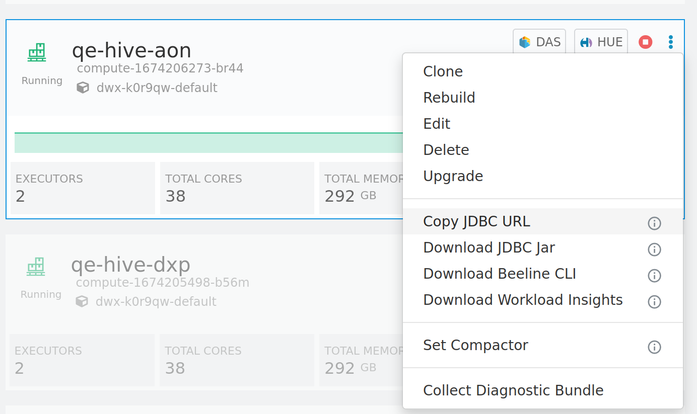

Cloudera provider for data orchestration with Apache Airflow.

## Overview

Use Cloudera Airflow provider with [Cloudera Data Engineering](https://docs.cloudera.com/data-engineering/cloud/index.html) and [Cloudera Data Warehouse](https://docs.cloudera.com/data-warehouse/cloud/index.html) services to get convenience of [Apache Airflow](https://github.com/apache/airflow) in your data orchestration and scheduling.
Cloudera Airflow provider comes with the following features:
- CdeRunJobOperator: launches a CDE job
- CdwExecuteQueryOperator: executes a SQL query on CDW

Python package: [cloudera-airflow-provider](https://pypi.org/project/cloudera-airflow-provider/)

Change log: [can be found here](CHANGELOG.md)

## Getting started

### Installation

[Cloudera Airflow Provider](https://pypi.org/project/cloudera-airflow-provider/) is a python package that can be simply installed through pip:
 
```shell script
pip install cloudera-airflow-provider
```

### Setting up the Airflow Connections

#### Cloudera Data Engineering connection
  
Connection contain parameters:

| Parameter | Description | Value |
| :--- | :---- | :--- |
| ID | Id of the Airflow connection of the target CDE Virtual cluster | Simple string making the Virtual cluster identifiable |
| Type | Airflow connection type | 'cloudera_data_engineering' Note: you need to set up operator package first |
| Host | [Virtual Cluster](https://docs.cloudera.com/data-engineering/cloud/manage-clusters/topics/cde-create-cluster.html) Jobs Api URL | From the CDE home page, go to Overview > Virtual Clusters > Cluster Details of the Virtual Cluster (VC) where you want the CDE job to run. Click JOBS API URL to copy the URL |
| Login | CDP access key of the account for running jobs on the CDE VC | Customer credentials | 
| Password | Provide the CDP private key associated to the given CDP Access Key | Customer credentials |
| Extra | Optional settings in JSON format | Please refer table below |

Extra parameters for Cloudera Data Engineering connection:

| Parameter | Description | Default value |
| :--- | :---- | :--- |
| proxy | Optional, translates to `https_proxy`/`HTTPS_PROXY` env. variables | None |
| cache_dir | Optional, to replace default cache_directory e.g. if insufficient access rights | `token_cache` |
| region | Optional, CDP Control Plane region ("us-west-1", "eu-1" or "ap-1") | Will be inferred automatically, if not specified |

Extra parameters for Cloudera Data Engineering connection for development use only (do not use them unless you know what you are doing) :

| Parameter | Description | Default value |
| :--- | :---- | :--- |
| altus_iam_endpoint | Optional | https://iamapi.us-west-1.altus.cloudera.com |
| ca_cert_path | Optional, custom ca certificates path | None |
| cdp_endpoint | CDP service endpoint | https://api.us-west-1.cdp.cloudera.com |
| insecure | Optional, insecure mode (no certs check) | False |

You can set up a connection according to the following snippet:

```bash

airflow connections add '{your connection id}' \
    --conn-type 'cloudera_data_engineering' \
    --conn-host '{Jobs API URL from Virtal Cluster}' \
    --conn-login '{your key id}' \
    --conn-password '{your key secret}'  \
    --conn-extra '{"region": "us-west-1"}'
```

#### Hive CLI connection to Cloudera Data Warehouse

Connection contain parameters:

| Parameter | Description | Value |
| :--- | :---- | :--- |
| ID | Id of the Airflow connection of the target CDW Virtual Warehouse | Simple string making the Virtual Warehouse identifiable |
| Type | Airflow connection type | 'hive_cli'. Note: in Airflow UI it is available as "Hive Client Wrapper" |
| Host | URL of related CDW connection | On CDW Virtual Warehouse UI: click 'More' > 'Copy JDBC connection link' |
| Schema | Hive schema | 'default' or your preferred |
| Login | Your workload user in CDP profile | Customer credentials |
| Password | Workload password | Customer credentials |

##### How to obtain host parameter for Hive CLI connection

This link contain URL needed to set up Hive CLI connection on Airflow.

You can refer snippet to set such connection via the CLI:

```shell script
airflow connections add '{your connection id}' \
  --conn-type 'hive_cli' \
  --conn-host '{your_url_from_JDBC_connection_on_virtual_warehouse}' \
  --conn-schema 'default' \
  --conn-login "{your_workload_user}" \
  --conn-password "{your-workload-password}"
```

### Usage details

#### CdeRunJobOperator

Runs a [job](https://docs.cloudera.com/data-engineering/cloud/cli-access/topics/cde-cli-manage-jobs.html) in a CDE [Virtual Cluster](https://docs.cloudera.com/data-engineering/cloud/manage-clusters/topics/cde-create-cluster.html). The `CdeRunJobOperator` runs the
named job with optional variables and overrides. The job and its resources
must have already been created via the specified virtual cluster jobs API.

| Arguments | Type | Description |
| :--- | :---- | :--- |
| job_name | str | The name of the job on the target virtual cluster, required |
| connection_id | str | The Airflow connection id for the target API endpoint, default value `'cde_runtime_api'`. Please note that in CDE Airflow all of the connections of the Virtual Clusters within a CDE Service are available out of the box |
| variables | dict | A dictionary of key-value pairs to populate in the job configuration, default empty dict |
| overrides | dict | A dictionary of key-value pairs to override in the job configuration, default empty dict |
| wait | bool | If set to true, the operator will wait for the job to complete in the target cluster. The task exit status will reflect the  status of the completed job. Default `True` |
| timeout | int | The maximum time to wait in seconds for the job to complete if `wait=True`. If set to `None`, 0 or a negative number, the task will never time out. Default `0` |
| job_poll_interval | int | The interval in seconds at which the target API is polled for the job status. Default `10` |
| api_retries | int | The number of times to retry an API request in the event of a connection failure or non-fatal API error. The parameter can be used to overwrite the value used by the cde hook used by the operator. The value precedence is 'parameter' > 'env var' > 'airflow.cfg' > 'default'. The `AIRFLOW__CDE__DEFAULT_NUM_RETRIES` environmemt variable can be used to set the value. Default value in the cde hook: `9` |
| api_timeout | int | The timeout in seconds after which, if no response has been received from the API, a request should be abandoned and retried. The parameter can be used to overwrite the value used by the cde hook. The value precedence is 'parameter' > 'env var' > 'airflow.cfg' > 'default'. The `AIRFLOW__CDE__DEFAULT_API_TIMEOUT` environmemt variable can be used to set the value. The timeout value for the job run status check is calculated separately. The tenth of the `api_timeout` value is used if it is not less than `CdeHook.DEFAULT_API_TIMEOUT // 10`. If it is less the `CdeHook.DEFAULT_API_TIMEOUT // 10` value will be used. Default value in the cde hook: `300` |

Example CDE operator DAG snippet:
```python
cde_task = CdeRunJobOperator(
    connection_id='my_vc_name',
    task_id='cde_task',
    dag=example_dag,
    job_name='example-scala-pi'
)
```
Please refer for complete [example DAG](../docs/examples/cde_operator_example.py).

#### CdwExecuteQueryOperator

Executes hql code in CDW. This class inherits behavior from HiveOperator, and instantiates a CdwHook to do the work.

Please refer the [additional preconditions](../docs/cdw-operator-preconditions.md) for CDW operator on custom Airflow environment.

| Arguments | Type | Description |
| :--- | :----   | :--- |
| cli_conn_id | str | The Airflow connection id for the target CDW instance, default value `'hive_cli_default'` |
| schema | str | The name of the DB schema, default value `'default'` |
| hql | str | Hive query string |
| hiveconfs | dict | An optional dictionary of key-value pairs to define hive configurations |
| hiveconf_jinja_translate | bool |  default value `False` |
| jdbc_driver | str | Package name of the Impala jdbc_driver, for instance "com.cloudera.impala.jdbc41.Driver". Required for Impala connections. None by default |
| query_isolation | bool | Controls whether to use cdw's query isolation feature. Only hive warehouses support this at the moment. Default `True` |

Example CDW operator DAG snippet: 
```python
cdw_step = CdwExecuteQueryOperator(
    task_id='cdw-test',
    dag=example_dag,
    cli_conn_id='cdw-beeline',
    hql=f"USE default; SELECT 'a', 'b', 1",
)
```

## Next steps

You can learn more about CDE concepts [here](https://docs.cloudera.com/data-engineering/cloud/cli-access/topics/cde-cli-concepts.html).

More examples you can find with [example DAGs](../docs/examples/README.md). 

Please refer the the [official documentation](https://docs.cloudera.com/data-engineering/cloud/orchestrate-workflows/topics/cde-airflow-dag-pipeline.html) for how to integrate these operators into your pipelines.
