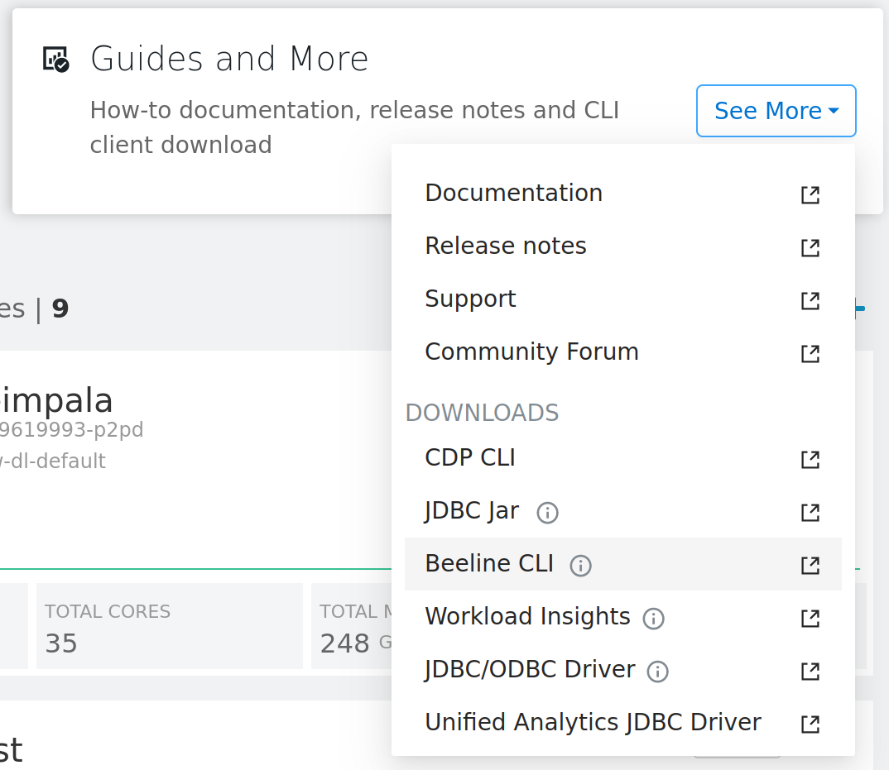

# CDW operator preconditions.

This page describes the prerequisites required to run CDW operators on a self-maintained Airflow installation (non-CDE managed Airflow).
It is assumed that Airflow is already installed and configured

Please refer [setup Hive CLI connection](../README.md#hive-cli-connection-to-cloudera-data-warehouse) section.

##  Installation of the Beeline CLI.

[Apache Beeline](https://cwiki.apache.org/confluence/display/Hive/HiveServer2+Clients#HiveServer2Clients-Beeline%E2%80%93CommandLineShell) is the CLI tool used by the CDW Airflow operator.

You must download the Beeline CLI toolset corresponding to the CDW instance which is used from the CDW Virtual Warehouse UI:



Please ensure that 'beeline' binary is part of the $PATH environment variable on your Airflow hosts.

You can install it according to snippet:

```shell script

# Dependencies for beeline CLI.
yum install -y java-11-openjdk
export JAVA_HOME=/usr/lib/jvm/jre-11-openjdk

# Download Apache Beeline archive.
# Assuming it is apache-hive-beeline-3.1.3000.tar.gz

# Extract archive.
tar -xzf apache-hive-beeline-3.1.3000.tar.gz

# Set the HIVE_HOME and PATH.
export HIVE_HOME=$PWD/apache-hive-beeline-3.1.3000.2022.0.8.0-3
export PATH=$PATH:$HIVE_HOME/bin
```

## Check beeline connection. 

You can check connection from host to CDW with following snippet:

```shell script
beeline -u $JDBC_URL -n $USER -p $PASSWD --hiveconf hive.query.isolation.scan.size.threshold=0B --hiveconf hive.query.results.cache.enabled=false --hiveconf hive.auto.convert.join.noconditionaltask.size=2505397589  --verbose
```

Where:

- **JDBC_URL** - link obtained from the CDW Virtual Warehouse. Please refer to the [related doc section](../README.md#how-to-obtain-jdbc-link-for-hive-cli-connection).

- **USER** - CDP Workload user.

- **PASSWD** - CDP Workload password.